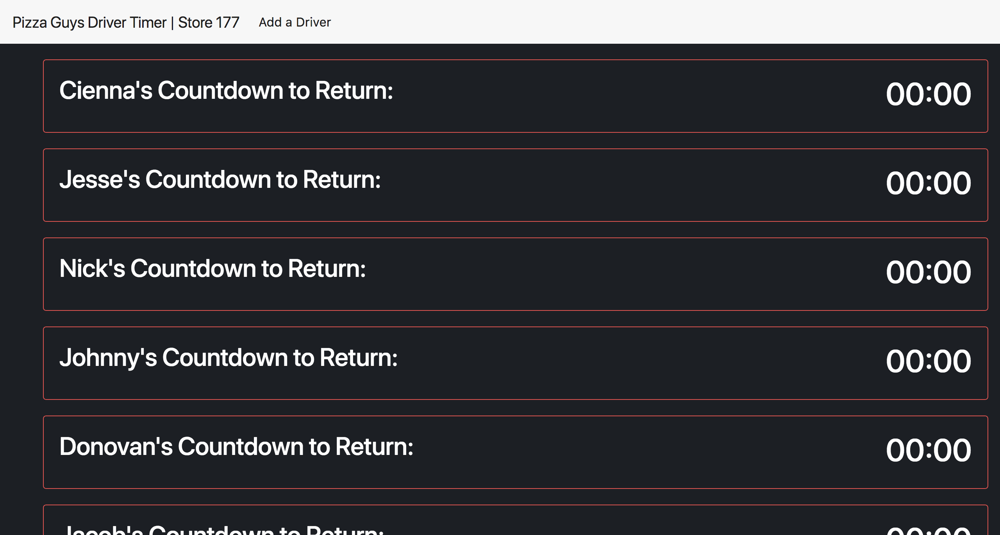

# The 2nd Version of the Driver Timer (Nessie)
##### Check out the first version [here]("https://github.com/CodingTea17/driver-timer-v1-php").

## Concept

The idea was to create a simple application to increase delivery efficiency. Drivers were required to call back after every delivery so that shift leads could route the upcoming deliveries and 'insiders' could prepare those orders to be ready as soon as the driver returned. Ideally a driver would return from a delivery and immediately leave on the next. However, that was almost never the case. During rush periods shift leads were unable to mentally keep track of who was returning and phone calls to the store were often not even reported to the shift lead. Drivers would return and the next delivery would not have even been 'slapped out'(rolled out and tossed), delaying an order by 15+ minutes.

#### Goals of the Original Driver Timer:

* Provide accurate, consistent communication between the drivers and shift lead
* Reduce distractions for driver (e.g. making a phone call while driving back to the store)
* Improve delivery overall times by cutting down out-the-door times

#### Goals of the 2nd Driver Timer:

* Rewrite the application to be used at multiple stores.
* Integrate with a cheaper communications API (Nexmo)
* Use a database to store drivers and allow in app driver addition.

#### Tech

In order to accomplish these new goals I started from the ground up utilizing MongoDB, Express, and NodeJS to build the new application. I used Express to route the driver timer to different Pizza Guy store numbers and act as the webhook to handle incoming messages from Nexmo. As messages were received the application determined who sent the SMS by the sender's phone number and updated that driver's return time in the database. Each store number route loaded all the drivers for that store and displayed them on the screen. In order to increase the number of drivers that could be shown on the screen it orders by most recent message. A driver can be added to a store via a form that associates a driver's phone number and name with the store number params.

#### Results

A much improved application that allows more Pizza Guy stores to use the application with ease. The form for new drivers keeps me from having to manually hard code drivers into the application as I did with the original driver timer (Frankenstein). The default ordering of drivers by most recent messages allows a store to more than 6 drivers which was another limitation of the first version. It's more aesthetically pleasing and I incorporated Pizza Guy colors into its design.

#### Looking Forward

It's better but still not great. It lacks authentication and basic delete/update functionality. There are some issues with the notification sound not always playing if a driver sends a message while the page reloads which it does every 10 seconds. To bring this up to a full production application I need to update it to have those features and squash those bugs. I plan to make the third version my Epicodus capstone project. I intend to once again start from the ground up, this time using Ruby on Rails as a backend for receiving messages, storing driver data, and handling users and ReactJS as the frontend for displaying the timers. I want to build out more functionality such as the ability to accept and display messages from the drivers. E.g. '20#heavy traffic might be a while'.

#### Screenshot

